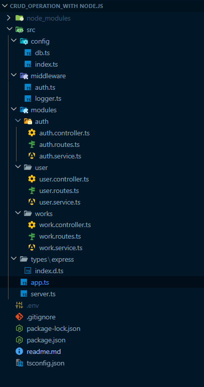

npm init -y

npm install express --save

npm install -D typescript

npx tsc --init

npm i --save-dev @types/express

npm i -D tsx (Go to Package.json file and in script you will add ("dev": "npx tsx watch ./src/server.ts"))

npm run dev

npm i pg

npm i dotenv

for password go to  Bcrypt ( npm i bcryptjs ) and go to jwt token ( npm i jsonwebtoken,npm i --save-dev @types/jsonwebtoken )

(Modular Pattern)--->RCS

How to deploy Backend Server 

tsc

Go to package.json and in scripts you will add (  “build”:”tsc”  )

npm run build

Vercel.com, Render.com (open create account)

npm i -g vercel

vercel login (verify account)

create vercel.json

deploy express typescript app to vercel 

https://medium.com/@hammadafzal1111/deploy-your-node-js-typescript-app-on-vercel-the-ultimate-guide-43cf7848cf09 

vercel --prod  =>press y

